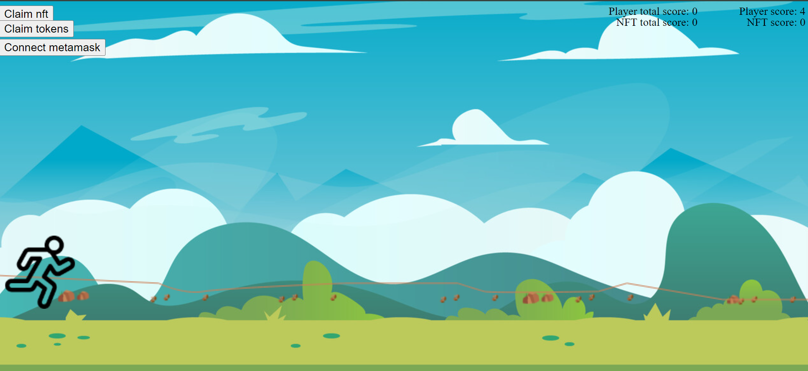

##  Web3.0 Token Game

# About the Game 

The Web3.0 Token Game is a revolutionary web-based game that leverages blockchain technology and decentralized finance (DeFi) to engage and reward users.
 
Players collect and stake tokens within the game to progress and increase their in-game currency. These tokens can be easily transferred to other blockchain platforms, fostering interoperability and utility across the entire DeFi ecosystem.

### By playing this game, you will:
<li>Gain experience with Web3.0 technology and DeFi applications</li>
<li>Interact with smart contracts and decentralized autonomous organizations (DAOs)</li>
<li>Collect and stake unique tokens</li>
<li>Participate in an innovative, user-friendly game</li>

# How to Play
<li> Play in Desktop to avoid hassle of Metamask Transction in Mobile</li>
<li>Download and install MetaMask, a browser-based Ethereum wallet that allows you to interact with decentralized applications.</li>
<li>Create an account and add funds to your MetaMask wallet.</li>
<li>Connect your MetaMask wallet to the Web3.0 Token Game by clicking on the "Connect to MetaMask" button.</li>
<li>Once connected, you can start collecting tokens by navigating through the game's environment.</li>
<li>Stake your tokens to enhance your in-game currency and increase your chances of winning the game.</li>

Please note that the game is still in its beta phase and may not be available on your preferred device. Keep an eye on our social media channels for updates on game releases and platforms.

# FAQ

## How do I know if I have won the game?

When you have reached the end of the game and have fulfilled all the necessary objectives, a victory screen will be displayed, confirming your success.

## What happens to my tokens if I decide to quit the game?

If you decide to quit the game before winning, you can always retrieve your tokens by connecting your MetaMask wallet to the game. However, if you choose to stake your tokens, you will not be able to withdraw them until you fulfill the necessary conditions.

## Is there a way to speed up the game process or avoid losing my tokens?

The Web3.0 Token Game is designed to simulate a real-world scenario where the pace of the game may vary. To avoid losing your tokens, ensure that you fulfill the necessary objectives and stake them to increase your chances of winning.

# Disclaimer

The Web3.0 Token Game is provided on an "as is" basis, without warranties of any kind. Players are solely responsible for their interaction with the game and should exercise due diligence when choosing to connect their MetaMask wallet to the game. By playing the game, you acknowledge that the game's contracts have been audited and no further responsibility is shouldered by the game's developers or token holders.

 

## This project is for educational purposes only. The creators are not responsible for any financial losses resulting from the use of this application. 